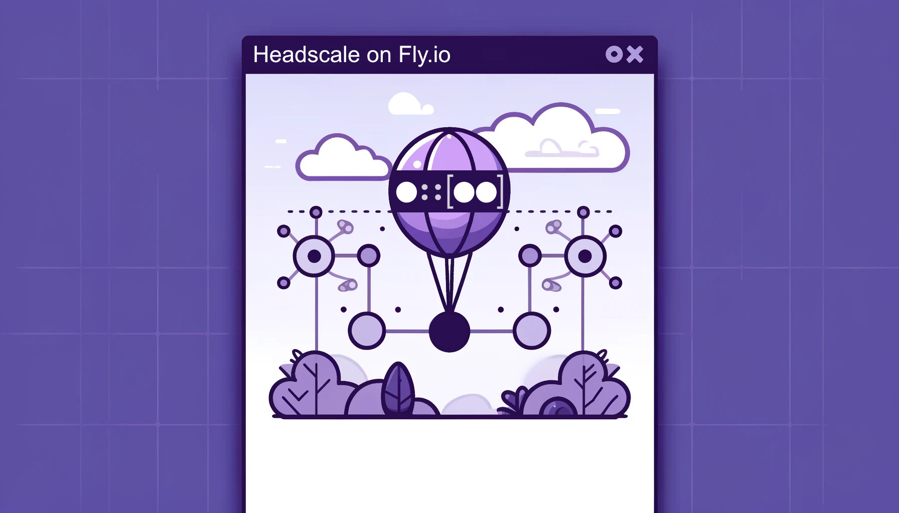

<p align="center">
  
</p>

# Headscale on Fly.io (and Kubernetes!)

This repository builds a Docker image that can be run as an app on [Fly.io] or **Kubernetes** to create an easy, robust and affordable
deployment of [Headscale] (an open source implementation of the [Tailscale] control plane, allowing you to create your
self-hosted virtual private network using Tailscale clients). It uses [Litestream] to replicate and restore the SQlite
database from an S3 bucket (such as [Tigris] bucket integrated with your Fly.io app).

The default configuration is to use the cheapested VM size available, `shared-cpu-1x`. This sizing should be sufficient
to support tens if not up to 100 nodes in your VPN while costing you approx. 2 USD/mo (depending on the region). Tigris
object storage has a free allowance of 5GB/mo, which you will likely not exceed. (By default we run Litestream with a
longer sync interval to not exceed the free Tigris API request limit all too easily).

Note that, because Tailscale connected devices report back to the control plane on a regular, short interval, you won't
be able to benefit from Fly.io technically being able to automatically scale your application down to 0, unless you have
no nodes connected.

  [Fly.io]: https://fly.io
  [Headscale]: https://github.com/juanfont/headscale
  [Litestream]: https://litestream.io/
  [Tailscale]: https://tailscale.com/
  [Tigris]: https://fly.io/docs/tigris/

__Contents__

<!-- toc -->
- [Headscale on Fly.io (and Kubernetes!)](#headscale-on-flyio-and-kubernetes)
  - [Kubernetes Deployment](#kubernetes-deployment)
    - [Features](#features)
    - [Quick Start (Kubernetes)](#quick-start-kubernetes)
  - [Fly.io Deployment](#flyio-deployment)
  - [Prerequisites](#prerequisites)
  - [Installation](#installation)
  - [Usage](#usage)
  - [Updates](#updates)
  - [Advanced configuration and usage](#advanced-configuration-and-usage)
    - [ACLs](#acls)
    - [Configuring OIDC](#configuring-oidc)
    - [Headplane Web UI](#headplane-web-ui)
      - [Accessing Headplane](#accessing-headplane)
      - [Headplane Configuration](#headplane-configuration)
    - [Using a custom domain](#using-a-custom-domain)
    - [Metrics](#metrics)
    - [Environment variables](#environment-variables)
    - [Migrating to Headscale on Fly.io](#migrating-to-headscale-on-flyio)
    - [Migrating from Postgres](#migrating-from-postgres)
    - [litestream-entrypoint.sh](#litestream-entrypointsh)
  - [Development](#development)
  - [Integration testing](#integration-testing)
<!-- end toc -->

## Kubernetes Deployment

This project also includes a **Helm chart** for deploying Headscale on Kubernetes with feature parity to the Fly.io deployment.

### Features

- **Ingress Support** - Traditional Kubernetes Ingress (nginx, traefik, etc.)
- **Gateway API Support** - Modern Gateway API (HTTPRoute, GRPCRoute)
- **TLS/Certificate Management** - Integration with cert-manager
- **Litestream Replication** - S3-compatible backup/restore
- **OIDC Authentication** - OpenID Connect support
- **Prometheus Metrics** - ServiceMonitor for monitoring

### Quick Start (Kubernetes)

```bash
# Install with Ingress
helm install headscale ./charts/headscale \
  --namespace headscale --create-namespace \
  --set headscale.domainName=vpn.example.com \
  --set ingress.enabled=true \
  --set ingress.className=nginx

# Or with Gateway API
helm install headscale ./charts/headscale \
  --namespace headscale --create-namespace \
  --set headscale.domainName=vpn.example.com \
  --set gatewayApi.enabled=true \
  --set 'gatewayApi.httpRoute.hostnames[0]=vpn.example.com'
```

For detailed Kubernetes documentation, see the [Helm chart README](./charts/headscale/README.md).

---

## Fly.io Deployment

## Prerequisites

* An account on [Fly.io]
* The [fly](https://github.com/superfly/flyctl) CLI
* The [age](https://github.com/FiloSottile/age) CLI

## Installation

Copy [`fly.example.toml`](./fly.example.toml) to a `fly.toml` file and modify it. The minimum change you need to make
is to update the `app` field. Unless you configure a [custom domain](#using-a-custom-domain), this will define the name
of your Headscale server (i.e. `https://<app>.fly.dev`).

You then need to create the app, create object storage and initialize secret values that Headscale requires to run.
These steps can be performed with the following commands. Note that the storage name can be anything, but if you don't
have a better name, just give it the same name as the app.

    $ fly apps create <app>
    $ fly storage create -a <app> -n <name>
    $ age-keygen -o age.privkey
    $ fly secrets set NOISE_PRIVATE_KEY="privkey:$(openssl rand -hex 32)" AGE_SECRET_KEY="$(tail -n1 age.privkey)"

All that's left now is to deploy the application. After initial deployment, you should scale the application down to
one, (or pass `--ha=false` to the deploy command), as the initial deploy will default to set the machine count to two.
Despite the SQlite database being replicated, it does not support multiple users that independently write data to the
same database.

    $ fly deploy
    $ fly scale count 1

> You could run the SQlite database with something like [LiteFS] to achieve a highly available installation of
> Headscale, but that is not currently supported in this project.

  [LiteFS]: https://github.com/superfly/litefs

## Usage

On a device, run

    $ tailscale up --login-server https://<app>.fly.dev

Following the link that will be displayed in the console will give you the `headscale` command to run to register
the device. You may need to create a user first with the `headscale user create` command. If you have not
[configured OIDC](#configuring-oidc), you need to use the Headscale CLI to register the node in the control plane.

For this you can either shell into your Headscale deployment via `fly ssh console` and use the `headscale` command
there, or use the Headscale CLI locally to remotely control it. For this, you must have first generated an API key
by connecting via SSH and running `headscale apikeys create`.

Then, locally, make sure you have the same version of the Headscale CLI installed that is running on your Fly.io app
and follow [as documented](https://headscale.net/ref/remote-cli/?h=api#download-and-configure-headscale). We use the
same typical gRPC port (`50443`).

    $ export HEADSCALE_CLI_ADDRESS=${FLY_APP_NAME}.fly.dev:50443
    $ export HEADSCALE_CLI_API_KEY=...
    $ headscale node list

## Updates

You should use an immutable tag in your `fly.toml` configuration file's `[build.image]` parameter. Using a mutable tag,
such as `:main` (pointing to the latest version of the `main` branch of this repository), does not guarantee that your
deployment comes up with the latest image version as a prior version may be cached.

Simply run `fly deploy` after updating the `[build.image]`. Note that there will be a brief downtime unless you
configured a highly available deployment. Be sure to check the release notes to see if there are any breaking changes
that require an update to your apps configuration!

## Advanced configuration and usage

### ACLs

We configure Headscale to store the ACL in the database instead of from file, this allows updating the ACLs without
a `fly deploy` on every update. Follow the above steps to remote-control the Headscale server and then use the
`headscale policy get` and `headscale policy set` commands.

### Configuring OIDC

To enable OIDC, you must at the minimum provide the following environment variables:

* `HEADSCALE_OIDC_ISSUER`
* `HEADSCALE_OIDC_CLIENT_ID`
* `HEADSCALE_OIDC_CLIENT_SECRET`

Please make sure that you pass the client secret using `fly secrets set` instead of via the `[[env]]` section of
your `fly.toml` configuration file.

### Headplane Web UI

This deployment includes [Headplane](https://headplane.net/), a full-featured web-based admin interface for Headscale.
Headplane provides:

- 👥 Single-sign-on integration
- 🔎 Detailed Tailnet overview and host information
- 📝 Configure Headscale settings including networking and auth controls

#### Accessing Headplane

Once deployed, access Headplane at `https://<your-domain>/admin` (or `https://<your-app-name>.fly.dev/admin`).

On first access, you'll need a Headscale API key. Generate one with:

```bash
$ fly ssh console -C "headscale apikeys create --expiration 90d"
```

Copy the API key and use it to log in to Headplane.

#### Headplane Configuration

Headplane is disabled by default. To enable it, set:

```toml
[env]
  HEADPLANE_ENABLED = "true"
```

**Enabling OIDC for Headplane:**

To enable single sign-on for Headplane, first register the callback URL in your OIDC provider:
- **Callback URL:** `https://<your-domain>/admin/oidc/callback`
- Example: `https://tailscale.microcloud.dev/admin/oidc/callback`

Then set the following environment variables:

```bash
$ fly secrets set HEADPLANE_OIDC_CLIENT_SECRET=<your-client-secret>
$ fly secrets set HEADPLANE_OIDC_HEADSCALE_API_KEY=$(fly ssh console -C "headscale apikeys create --expiration 999d")
```

Add to your `fly.toml`:

```toml
[env]
  HEADPLANE_OIDC_ISSUER = "https://accounts.google.com"
  HEADPLANE_OIDC_CLIENT_ID = "your-client-id"
```

**Note:** For the best experience, use the **same** OIDC client ID for both Headscale and Headplane.

**Logs:**

Both Headscale and Headplane log to stdout/stderr, so all logs are visible in `fly logs`.

**Architecture:**

Headplane runs alongside Headscale in the same container, with nginx routing:
- `/` → Headscale (API and control plane)
- `/admin` → Headplane (web UI)

For more information, see the [Headplane documentation](https://headplane.net/).

### Using a custom domain

1. Create a CNAME entry for your Fly.io application
2. Run `fly certs add <custom_domain>`
3. Set the `HEADSCALE_DOMAIN_NAME=<custom_domain>` in the `fly.toml`'s `[env]` section and re-deploy

See also the related documentation on [Fly.io: Custom domains](https://fly.io/docs/networking/custom-domain/).

### Metrics

Metrics are automatically available through Fly.io's built-in managed Prometheus metrics collection and Grafana
dashboard. Simply click on "Metrics" in your Fly.io account and explore `headscale_*` metrics.

### Environment variables

Many Headscale configuration options can be set vie the `[env]` section in your `fly.toml` configuration file. The
following is a complete list of the environment variables the Headscale-on-Fly.io recognizes, including those that
are expected to be set automatically.

__System variables__

| Variable                | Default     | Description                                                                                                                                    |
| ----------------------- | ----------- | ---------------------------------------------------------------------------------------------------------------------------------------------- |
| `AWS_ACCESS_KEY_ID`     | (automatic) | Access key for the object storage for Litestream SQlite replication. Usually set automatically by Fly.io when enabling the Tigris integration. |
| `AWS_SECRET_ACCESS_KEY` | (automatic) | Secret key for the object storage.                                                                                                             |
| `AWS_REGION`            | (automatic) |                                                                                                                                                |
| `AWS_ENDPOINT_URL_S3`   | (automatic) |                                                                                                                                                |
| `BUCKET_NAME`           | (automatic) |                                                                                                                                                |
| `FLY_APP_NAME`          | (automatic) | Used to determine the Headscale server URL, if `HEADSCALE_DOMAIN_NAME` is not set.                                                             |

__Security variables__

| Variable            | Default           | Description                                                                                                                                            |
| ------------------- | ----------------- | ------------------------------------------------------------------------------------------------------------------------------------------------------ |
| `AGE_SECRET_KEY`    | n/a, but required | [age] Secret key for encryption your Litestream SQLite replication.                                                                                    |
| `NOISE_PRIVATE_KEY` | n/a, but required | Noise private key for Headscale. Generate with `echo privkey:$(openssl rand -hex 32)`. **Important:** Pass this value securely with `fly secrets set`. |

__Headscale configuration variables__

| Variable                                         | Default                                                        | Description                                                                                                                                                                                                                                                                                        |
| ------------------------------------------------ | -------------------------------------------------------------- | -------------------------------------------------------------------------------------------------------------------------------------------------------------------------------------------------------------------------------------------------------------------------------------------------- |
| `HEADSCALE_DOMAIN_NAME`                          | `${FLY_APP_NAME}.fly.dev`                                      | URL of the Headscale server.                                                                                                                                                                                                                                                                       |
| `HEADSCALE_DNS_BASE_DOMAIN`                      | `tailnet`                                                      | Base domain for members in the Tailnet. This **must not** be a part of the `HEADSCALE_DOMAIN_NAME`.                                                                                                                                                                                                |
| `HEADSCALE_DNS_MAGIC_DNS`                        | `true`                                                         | Whether to use [MagicDNS](https://tailscale.com/kb/1081/magicdns/).                                                                                                                                                                                                                                |
| `HEADSCALE_DNS_NAMESERVERS_GLOBAL`               | `1.1.1.1, 1.0.0.1, 2606:4700:4700::1111, 2606:4700:4700::1001` | A comma-separated list of global DNS servers to use. Defaults to Cloudflare DNS servers. To use NextDNS, supply the URL like `https://dns.nextdns.io/abc123`.                                                                                                                                      |
| `HEADSCALE_DNS_SEARCH_DOMAINS`                   | (empty)                                                        | A comma-separated list of search domains. Note that with MagicDNS enabled, tour tailnet base domain is always the first search domain.                                                                                                                                                             |
| `HEADSCALE_LOG_LEVEL`                            | `info`                                                         | Log level for the Headscale server.                                                                                                                                                                                                                                                                |
| `HEADSCALE_PREFIXES_V4`                          | `100.64.0.0/10`                                                | Prefix for IP-v4 addresses of nodes in the Tailnet.                                                                                                                                                                                                                                                |
| `HEADSCALE_PREFIXES_V6`                          | `fd7a:115c:a1e0::/48`                                          | Prefix for IP-v6 addresses of nodes in the Tailnet.                                                                                                                                                                                                                                                |
| `HEADSCALE_PREFIXES_ALLOCATION`                  | `random`                                                       | How IPs are allocated to nodes joining the Tailnet. Can be `random` or `sequential`.                                                                                                                                                                                                               |
| `HEADSCALE_EPHEMERAL_NODE_INACTIVITY_TIMEOUT`    | `30m`                                                          | The time after which an inactive ephemeral node is deleted from the control plane.                                                                                                                                                                                                                 |
| `HEADSCALE_OIDC_ISSUER`                          | n/a                                                            | If set, enables OIDC configuration. Must be set to the URL of the OIDC issuer. For example, if you use Keycloak, it might look something like `https://mykeycloak.com/realms/main`                                                                                                                 |
| `HEADSCALE_OIDC_CLIENT_ID`                       | n/a, but required if oidc is enabled                           | The OIDC client ID.                                                                                                                                                                                                                                                                                |
| `HEADSCALE_OIDC_CLIENT_SECRET`                   | n/a, but required if oidc is enabled                           | The OIDC client secret. **Important:** Configure this through `fly secrets set`.                                                                                                                                                                                                                   |
| `HEADSCALE_OIDC_SCOPES`                          | `openid, profile, email`                                       | A comma-separated list of OpenID scopes. (The comma-separated list must be valid YAML if placed inside `[ ... ]`.)                                                                                                                                                                                 |
| `HEADSCALE_OIDC_ALLOWED_GROUPS`                  | n/a                                                            | A comma-separated list of groups to permit. Note that this requires your OIDC client to be configured with a groups claim mapping. In some cases you may need to prefix the group name with a slash (e.g. `/headscale`). (The comma-separated list must be valid YAML if placed inside `[ ... ]`.) |
| `HEADSCALE_OIDC_ALLOWED_DOMAINS`                 | n/a                                                            | A comma-separated list of email domains to permit. (The comma-separated list must be valid YAML if placed inside `[ ... ]`.)                                                                                                                                                                       |
| `HEADSCALE_OIDC_ALLOWED_USERS`                   | n/a                                                            | A comma-separated list of users to permit. (The comma-separated list must be valid YAML if placed inside `[ ... ]`.)                                                                                                                                                                               |
| `HEADSCALE_OIDC_ALLOWED_USERS_FLY`               | n/a                                                            | A comma-separated list of users to permit. Takes precedence over `HEADSCALE_OIDC_ALLOWED_USERS` (The comma-separated list must be valid YAML if placed inside `[ ... ]`.)                                                                                                                          |
| `HEADSCALE_OIDC_EXPIRY`                          | `180d`                                                         | The amount of time from a node is authenticated with OpenID until it expires and needs to reauthenticate. Setting the value to "0" will mean no expiry.                                                                                                                                            |
| `HEADSCALE_OIDC_USE_EXPIRY_FROM_TOKEN`           | `false`                                                        | Use the expiry from the token received from OpenID when the user logged in, this will typically lead to frequent need to reauthenticate and should only been enabled if you know what you are doing. If enabled, `HEADSCALE_OIDC_EXPIRY` is ignored.                                               |
| `HEADSCALE_OIDC_ONLY_START_IF_OIDC_IS_AVAILABLE` | `true`                                                         | Fail startup if the OIDC server cannot be reached.                                                                                                                                                                                                                                                 |

__Headplane configuration variables__

| Variable                                    | Default                            | Description                                                                              |
| ------------------------------------------- | ---------------------------------- | ---------------------------------------------------------------------------------------- |
| `HEADPLANE_ENABLED`                         | `false`                            | Enable or disable the Headplane web UI.                                                  |
| `HEADPLANE_BASE_URL`                        | `https://${HEADSCALE_DOMAIN_NAME}` | Public URL where Headplane is accessible (required for OIDC callback URLs)               |
| `HEADPLANE_COOKIE_SECRET`                   | (auto)                             | Cookie encryption secret (automatically generated if not provided)                       |
| `HEADPLANE_PROC_ENABLED`                    | `true`                             | Enable process inspection for network management features                                |
| `HEADPLANE_OIDC_ISSUER`                     | n/a                                | OIDC issuer URL for Headplane SSO (e.g., `https://accounts.google.com`)                  |
| `HEADPLANE_OIDC_CLIENT_ID`                  | n/a                                | OIDC client ID for Headplane. **Important:** Should match Headscale's OIDC client ID     |
| `HEADPLANE_OIDC_CLIENT_SECRET`              | n/a                                | OIDC client secret for Headplane. **Important:** Use `fly secrets set`                   |
| `HEADPLANE_OIDC_HEADSCALE_API_KEY`          | n/a                                | Headscale API key for OIDC flow. **Important:** Use `fly secrets set`                    |
| `HEADPLANE_OIDC_SCOPE`                      | `openid email profile`             | OIDC scopes to request                                                                   |
| `HEADPLANE_OIDC_USE_PKCE`                   | `true`                             | Use PKCE for additional security (requires OIDC provider support)                        |
| `HEADPLANE_OIDC_DISABLE_API_KEY_LOGIN`      | `false`                            | Disable traditional API key login when OIDC is enabled                                   |
| `HEADPLANE_OIDC_TOKEN_ENDPOINT_AUTH_METHOD` | `client_secret_basic`              | Token endpoint authentication method (e.g., `client_secret_post`, `client_secret_basic`) |

__Litestream configuration variables__

| Variable                              | Default | Description                                                                                                                                                                                     |
| ------------------------------------- | ------- | ----------------------------------------------------------------------------------------------------------------------------------------------------------------------------------------------- |
| `LITESTREAM_ENABLED`                  | `true`  | Whether to restore and replicate the SQlite database with Litestream. You likely never want to turn this option off, as you will loose your SQlite database on restarts.                        |
| `LITESTREAM_RETENTION`                | `24h`   | Configure the Litestream retention period. Retention is enforced periodically and can be changed with `LITESTREAM_RETENTION_CHECK_INTERVAL`.                                                    |
| `LITESTREAM_RETENTION_CHECK_INTERVAL` | `1h`    | The interval at which retention should be applied.                                                                                                                                              |
| `LITESTREAM_VALIDATION_INTERVAL`      | `12h`   | The interval at which Litestream does a separate restore of the database and validates the result vs. the current database.                                                                     |
| `LITESTREAM_SYNC_INTERVAL`            | `10s`   | Frequency in which frames are pushed to the replica. Note that Litestream's typical default is `1s`, and increasing this frequency can increase storage costs due to higher API request counts. |

__Maintenance variables__

| Variable           | Default | Description                                                                                                                                                                                                                                                                                                   |
| ------------------ | ------- | ------------------------------------------------------------------------------------------------------------------------------------------------------------------------------------------------------------------------------------------------------------------------------------------------------------- |
| `ENTRYPOINT_DEBUG` | n/a     | If set to `true`, enables logging of executed commands in the container entrypoint and prints out the Headscale configuration before startup. Use with caution, as it might reveal secret values to stdout (and thus into Fly.io's logging infrastructure).                                                   |
| `ENTRYPOINT_IDLE`  | `false` | If set to `true`, go idle instead of starting the Headscale server. Will also go idle if an intermediate error occurs. Useful for recovering secrets when the deployment critically fails. Note that after a short time, Fly will turn off the machine since its health check won't be coming online.         |
| `IMPORT_DATABASE`  | `false` | If set to `true`, the entrypoint will check for an `import-db.sqlite` file in the S3 bucket to restore, and use that instead of `litestream restore` if it exists. Note that the file will not be removed, so you should disable this option and remove the file from the bucket once the import is complete. |

### Migrating to Headscale on Fly.io

To migrate your existing Headscale instance that uses SQlite to Fly.io, you must upload the database to the S3 bucket
under a file named `import-db.sqlite` and temporarily set the `IMPORT_DATABASE=true` environment variable. This will
instruct the application to load this database file instead of attempting a Litestream restore on startup. Once done
and Litestream has finished replicating this database state to S3, you must remove the `IMPORT_DATABASE` environment
variable and re-deploy your application, and you should also consider removing the `import-db.sqlite` file from the
S3 bucket again.

You should also make sure that you set the `NOISE_PRIVATE_KEY` secret variable to the contents of your original
Headscale instance's noise private key.

### Migrating from Postgres

> __Warning__: These steps have been tested on Headscale 0.23.0 only.

  [bigbozza/headscalebacktosqlite]: https://github.com/bigbozza/headscalebacktosqlite/tree/main

If your current Headscale deployment is using a Postgres database, you must convert it to an SQlite database before
you can migrate your instance to Headscale on Fly.io. You can leverage script provided by
[bigbozza/headscalebacktosqlite] for this, and it is more conveniently made available in this repository in
[./headscale-back-to-sqlite](./headscale-back-to-sqlite/).

First, you need to grab an empty SQlite database that was initialized by Headscale (so all the tables exist with the
right schemas). You can do this by grabbing it from an initial Fly.io deployment. If your deployment already has some
data in it because you did some prior testing, you can set the `LITESTREAM_ENABLED=false` environment variable to not
use Litestream and have Headscale start from an empty database (remember to unset this variable again once you have
retrieved the empty SQlite database).

Because Headscale is configured to use SQlite in WAL mode, we must first create a WAL checkpoint to ensure that the
database initialization is committed to the database file.

    $ fly deploy
    $ fly console ssh
    app> $ apk add sqlite
    app> $ sqlite3 /var/lib/headscale/db.sqlite
    app> sqlite3> PRAGMA wal_checkpoint(TRUNCATE);
    app> sqlite3> [Ctrl+D]
    app> $ exit
    $ fly ssh sftp get /var/lib/headscale/db.sqlite

  [UV]: https://github.com/astral-sh/uv

Change into the [./headscale-back-to-sqlite](./headscale-back-to-sqlite/) directory and use [UV] to run the script.

    $ uv run main.py \
        --pg-host db-host.example \
        --pg-port 5432 \
        --pg-db headscale \
        --pg-user headscale \
        --pg-password DBPASSWORD \
        --sqlite-out path/to/db.sqlite

> This will perform read-only operations on the Postgres database so you do not need to worry about creating a separate
> backup of your Postgres database.

  [mc]: https://min.io/docs/minio/linux/reference/minio-mc.html

If all succeeded, upload the database to the S3 bucket that Headscale on Fly.io also uses to replicate the database
to with Litestream. If you're using the Tigris object storage extension in Fly.io, you will likely need to log into
the Tigris console via the Fly.io dashboard and generate some temporary access credentials. The following example uses
the [mc] CLI to upload the file.

    $ mc alias set tigris https://fly.storage.tigris.dev <ACCESS_KEY_ID> <SECRET_ACCESS_KEY>
    $ mc cp path/to/db.sqlite tigris/<YOUR_BUCKET_NAME>/import-db.sqlite

Set the `IMPORT_DATABASE=true` environment variable and re-deploy your application.

    $ fly deploy --env IMPORT_DATABASE=true
    $ fly logs

Wait for the application to start, the database to be imported from S3 and Litestream to have replicated it to the
S3 bucket. Then re-deploy to remove the `IMPORT_DATABASE` variable.

    $ fly deploy

You should be good to go!

### litestream-entrypoint.sh

As part of this repository, the [`litestream-entrypoint.sh`](./headscale-fly-io/litestream-entrypoint.sh) can be
considered public API can consumed by other projects that want to use Litestream in the same fashion as this project.
It can be retrieved with curl or copied from the container published by the project under the
`/var/lib/headscale/litestream-entrypoint.sh` path, however you must pin a tagged version to ensure reproducability and
compatibility (newer versions might change in a backwards incompatible way).

Other projects that use this script include:

* [NiklasRosenstein/vaultwarden-on-fly](https://github.com/NiklasRosenstein/vaultwarden-fly-io)

## Development

Simply iterating via `fly deploy` works quite well!

To update the ToC in this file, run

    $ uvx mksync -i README.md

  [GitHub CLI]: https://cli.github.com/

Releases a tagged in the form of `<version>-headscale-<headscale_version>`. Requires that the [GitHub CLI].

    $ ./scripts/release 0.1.0-headscale-0.23.0

## Integration testing

We perform a lightweight integration test by deploying the application to a Fly.io app after successful build on
the `main` branch, which will fail if the application doesn't come up healthy.
